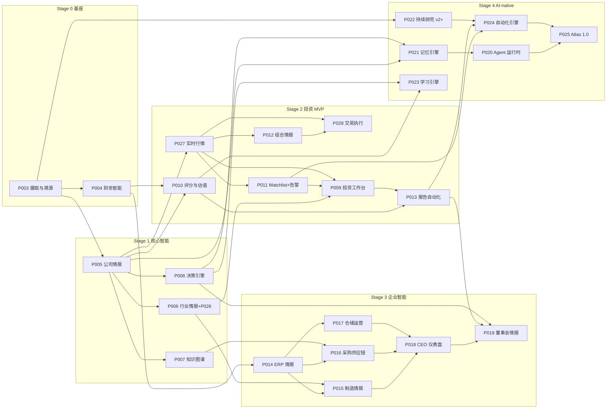

# Atlas 全模块设计 · Master Index (P003–P028)

> docs/design/00-master-index.md · 2026-07-21 · 分支目标 `docs/full-modular-design`
> 每模块一份 `docs/design/P0XX-<name>-design.md`，交付格式统一为七节：
> ①使命/决策问题 ②功能清单 v1/v2/v3+验收 ③后端（D1 表 · /v1/ API · domain 引擎 · CF 组件）
> ④前端（路由树 · 区块布局 · loader 四态 · 交互）⑤依赖 ⑥数据来源与 source.kind ⑦风险与 stop conditions。

## 0. 现状基线（不重新设计，只延伸）

- **已上线**：17 家公司真数据（10 AI 基建 · SEC EDGAR；7 大马手套 · Bursa PDF，2002→2026 共 555 季度）；
  财务引擎 facts→三大报表/指标/比率 全后端计算；溯源 source.kind: `seed / sec-edgar / glove-tracker / manual / estimate`。
- **前端基座**：Next.js 15 静态导出 → Cloudflare Pages；token 体系（已升级 Aurora Glass，见
  `00-visual-refresh.md` + `atlas-handoff/`）；组件库见 `docs/00-foundation/component-catalog.md`。
- **工程约束**：全 Cloudflare（Workers/Hono + D1/Drizzle + Pages；扩展仅 R2/Vectorize/Queues+Cron/Workers AI）；
  唯一数据路径 `loader → apiFetch<T> → Resource<T> → <DataState>`；UI 零计算零 fetch；缺数据显示 —。
- **P028 例外**：券商网关（moomoo OpenD / IB Gateway）需长开进程，引入独立 `trading-bridge`
  服务（VPS/本地，非 Cloudflare）——这是全平台唯一的非 CF 组件，边界在 P028 文档写死。

## 1. 模块总览

| # | 模块 | 一句话使命 | Stage | 状态 | 直接依赖 |
|---|------|-----------|-------|------|---------|
| P003 | 数据摄取与溯源基座 | EDGAR/Bursa 摄取管道与 source 溯源的正式化（现状整编） | 0 基座 | 部分已上线 | — |
| P004 | 财务智能引擎 | facts→报表/指标/比率，跨上市/私企/ERP 财务 | 0 基座 | 进行中 | P003 |
| P005 | 公司情报引擎 | 一家公司 5 分钟建立全景（档案/产品/管理层/股权/年表） | 1 | 设计 | P003 |
| P006 | 行业情报引擎 | 价值链/产能格局/成本因子/周期信号/同业对比（含 P026 手套迁移） | 1 | 设计 | P003 P005 |
| P007 | 知识图谱引擎 | 供应链/客户/竞争/持股关系与传导分析 | 1 | 设计 | P005 |
| P008 | 决策引擎 | 决策日志 + 假设追踪 + 复盘（判断为什么对/错） | 1 | 设计 | P005 |
| P009 | 投资工作台 | Home=投资驾驶舱：今日异动/财报日历/告警/最近研究 | 2 | 设计 | P005 P006 P011 P027 |
| P010 | 评分与估值 | 多因子 Atlas Score（版本化+证据链）+ 倍数带/简易 DCF | 2 | 设计 | P004 P005 |
| P011 | Watchlist + 告警 | 规则引擎（价格/财报/阈值/关键词）→ 告警流 | 2 | 设计 | P005 P027 |
| P012 | 组合情报 | 持仓/成本/权重/行业暴露/组合指标 | 2 | 设计 | P005 P027 |
| P013 | 报告自动化 | 真数据自动生成公司/行业/周报，可导出 | 2 | 设计 | P004–P010 |
| P014 | ERP 情报 | 销售/订单/SKU/客户 → 收入结构/客户集中度/SKU 毛利 | 3 | 设计 | P004 |
| P015 | 制造情报 | 产能/稼动率/良率/交期，自家 vs 行业对标 | 3 | 设计 | P006 P014 |
| P016 | 采购供应链 | 供应商表现/采购价 vs commodity/断供风险 | 3 | 设计 | P006 P007 P014 |
| P017 | 仓储运营 | 库存天数/周转/呆滞品 | 3 | 设计 | P014 |
| P018 | CEO 仪表盘 | 跨公司 KPI/现金流/异常警报（开会就看这页） | 3 | 设计 | P014–P017 |
| P019 | 董事会情报 | 董事会包自动生成 + 风险矩阵 + 决策待办 | 3 | 设计 | P008 P013 P018 |
| P020 | Agent 运行时 | 研究任务→工具调用→产出的 agent 编排 | 4 | 设计 | P021 |
| P021 | 记忆引擎 | 结论/实体画像长期记忆（D1+Vectorize） | 4 | 设计 | P005 P008 |
| P022 | 持续研究引擎 v2+ | 季度 YTD-diff、IFRS 映射、新闻/公告管道、Cron 全自动 | 4 | 设计 | P003 P004 |
| P023 | 学习引擎 | 预测 vs 实际复盘，评分模型迭代 | 4 | 设计 | P008 P010 |
| P024 | 自动化引擎 | 报告定时生成/告警推送/数据质量巡检 | 4 | 设计 | P011 P013 P022 |
| P025 | Atlas 1.0 | 整合验收：导航/权限/审计/性能预算/上线清单 | 4 | 设计 | 全部 |
| P026 | 手套周期迁移 | glove-tracker → P006 的 commodity/周期信号/Cron 移植 | 1 | 设计（并入 P006 文档） | P003 P006 |
| **P027** | **实时行情 Markets** | watchlist 实时报价/分时/K 线，Moomoo 级行情体验 | 2 | 设计 | P003 P005 |
| **P028** | **交易执行 Trading** | 美股手动确认下单（paper 默认），大马只出信号 | 2 | 设计 | P012 P027 + trading-bridge |

> P003/P004 属于既有基座：文档只做「正式化整编」（把已上线能力与缺口写清楚），不推倒。
> P026 不单独出文件，作为 P006 的 Phase 2–3 落在 P006 文档内（与老板 prompt 一致）。

## 2. 依赖图

## 3. 实施顺序（v1 最小闭环优先，可独立上线）

| 波次 | 模块 | 理由 |
|------|------|------|
| W1 | P005 → P006(含P026) | 一切页面的主语是公司与行业；手套迁移消掉外挂 glove-tracker |
| W2 | P027 → P011 → P012 | 行情是 watchlist/组合的数据前提；三者构成每日动线的上半段 |
| W3 | P008 → P010 | 决策日志先行（记录习惯越早越值钱）；评分吃 P004+P005 已就绪 |
| W4 | P009 → P013 | 驾驶舱与报告是汇聚层，等上游 v1 齐再拼装 |
| W5 | P028 (paper) | 交易走纸上模式闭环，验证 bridge 架构与风控，再谈真仓 |
| W6 | P007 → P021 | 图谱与记忆互相喂养，放在研究数据够厚之后 |
| W7 | P014 → P017 → P015/P016 → P18 → P019 | ERP 接入按「先数据后对标再汇总」 |
| W8 | P022 → P024 → P020 → P023 → P025 | 自动化与 agent 收尾，1.0 验收 |

## 4. 文档清单与状态

| 文件 | 状态 |
|------|------|
| 00-visual-refresh.md | ✅ 已定稿（1b Aurora Glass），token+组件已交付 atlas-handoff/ |
| 00-master-index.md | ✅ 本文件 |
| P003-P004-foundation-status.md（基座整编） | ✅ |
| P005 … P025 全部模块设计 | ✅ 每模块一份，七节格式 |
| P026 手套迁移 | ✅ 并入 P006 文档 Phase 2–3 |
| P027-markets-design.md / P028-trading-design.md | ✅ |

> 与现状冲突的改动会在各模块文档「⑤依赖」内标注「需改 X 因为 Y」。
